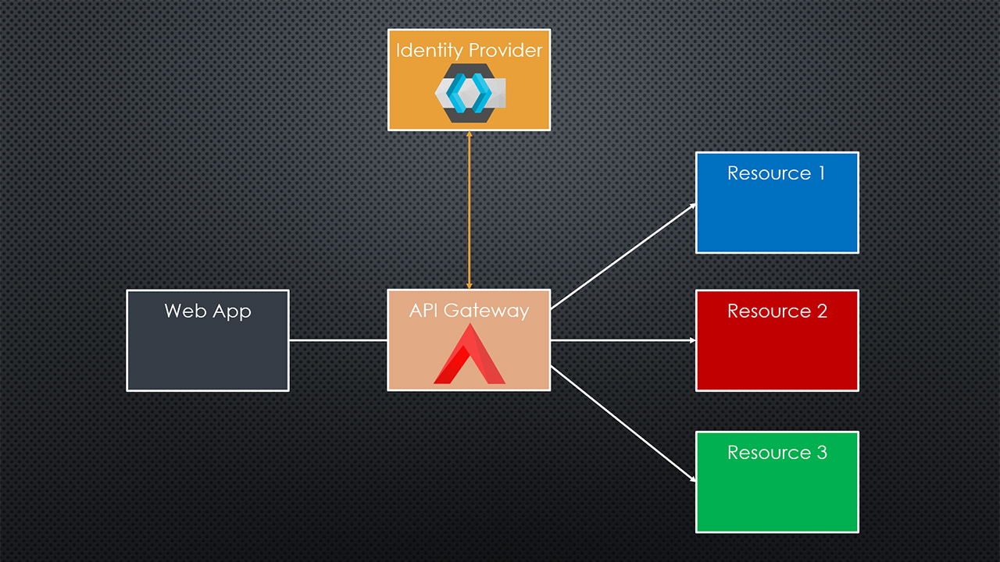

# APISIX - KEYCLOAK DEMO

This is a simple demo project showcasing the integration of [Apache APISIX](https://apisix.apache.org/) with [Keycloak](https://www.keycloak.org/) for authentication and authorization.

I use several APISIX plugins to achieve this integration and to manage basic routing:
- **redirect** - To redirect root requests to a specific resource path.
- **proxy-rewrite** - To modify request URIs for routing to backend services.
- **response-rewrite** - To manage response headers, such as disabling caching for authenticated responses.
- **openid-connect** - To handle authentication via Keycloak.
- **authz-keycloak** - To manage [authorization](https://www.keycloak.org/docs/latest/authorization_services/index.html) based on Keycloak roles and permissions.
- **serverless-pre-function** - To perform custom logic before request processing.

## Important References

- [APISIX Official Documentation](https://apisix.apache.org/docs/)
- [APISIX OpenID Connect Plugin](https://apisix.apache.org/docs/apisix/plugins/openid-connect/)
- [APISIX Keycloak Authorization Plugin](https://apisix.apache.org/docs/apisix/plugins/authz-keycloak/)
- [APISIX Plugins Priority](https://blog.frankel.ch/apisix-plugins-priority-leaky-abstraction/)
- [Keycloak Official Documentation](https://www.keycloak.org/documentation)
- [Keycloak Server Administration Guide](https://www.keycloak.org/docs/latest/server_admin/index.html)
- [Keycloak Authorization Services Guide](https://www.keycloak.org/docs/latest/authorization_services/index.html)

## Demo Setup

The demo setup consists of the following components that are orchestrated using Docker Compose:

- **api-gateway-service** - Apache APISIX acting as the API Gateway.
- **iam-service with iam-db-service** - Keycloak server for identity and access management including a Postgresql database.
- **resource-one-service** - A sample backend service protected by APISIX and Keycloak.
- **resource-two-service** - Another sample backend service protected by APISIX and Keycloak.
- **resource-three-service** - A third sample backend service protected by APISIX and Keycloak.

The three resources are simple html pages served via Nginx. But you can imagine those to be endpoints of an API, AI services, storage services, etc.

### Running the Demo

To run the demo, you need to have [Docker](https://www.docker.com/) and [Docker Compose](https://docs.docker.com/compose/) installed on your machine. On Windows, you can use [Docker Desktop](https://www.docker.com/products/docker-desktop/).

The you can simply run `./scripts/start.sh` from the project root directory to start all services. If you are on Windows, I recomment the Git Bash terminal that comes with [Git for Windows](https://gitforwindows.org/) to run the script.

After the services are started, you can access the demo using http://localhost. You will notice that nothing is accessible at first. You must first setup a Keycloak realm, client, roles, users and permissions. The [Keycloak Server Administration Guide](https://www.keycloak.org/docs/latest/server_admin/index.html) is a great resource to get started with Keycloak.

But I also recorded a Youtube Video in which I explain in-depth how to setup APISIX and Keycloak to secure your services. You can find the video below.

## Youtube Video

In this Youtube video I explain how to setup APISIX and Keycloak to secure your services:

TODO -> Insert Link

The topics I cover are things I learned by studying the documentation and a lot of trial and error. I hope the video saves you some time and helps you to get started quickly.

